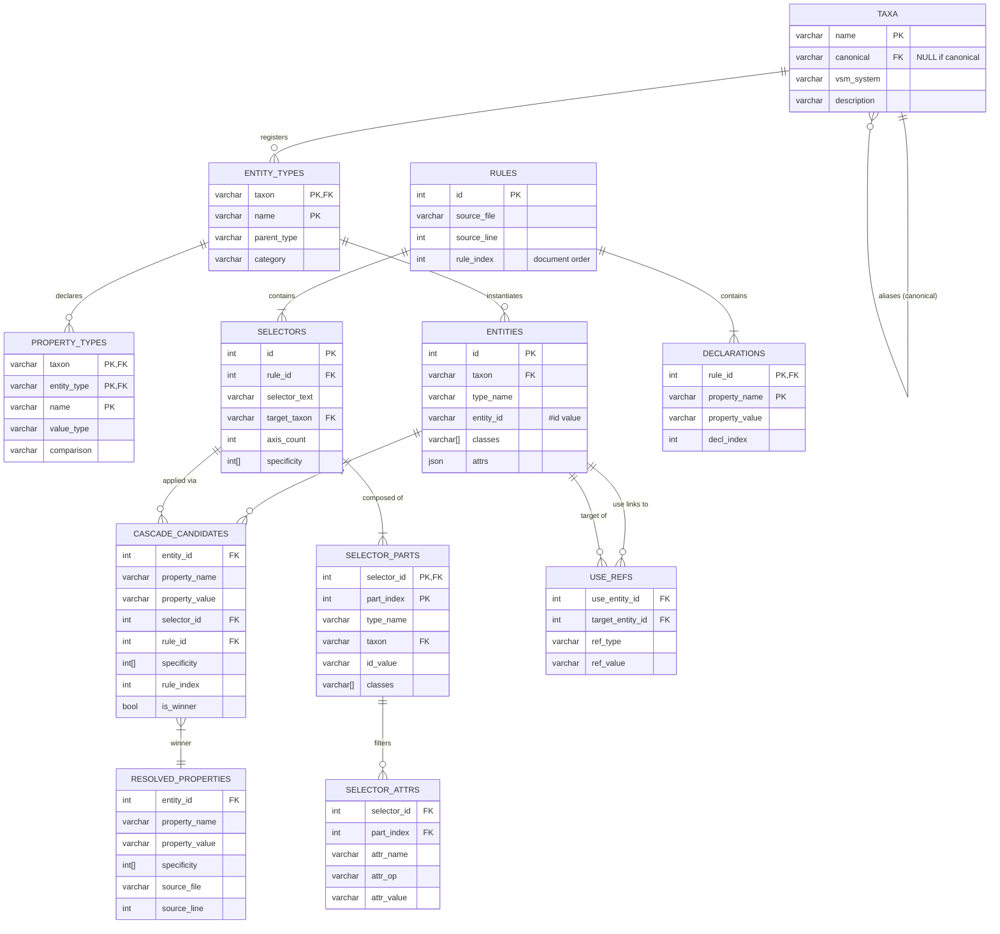
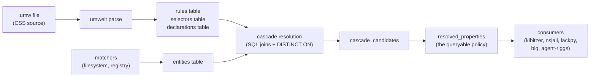

# The Rosetta Stone: umwelt CSS, SQL, and Datalog

*Every umwelt policy can be expressed in three equivalent forms. This document shows all three side by side, explains the compilation, and demonstrates the SQL schema that serves as the intermediate representation between them.*

---

## Reading guide

Each example shows three panels:

1. **umwelt (.umw)** — the CSS-shaped source the human writes.
2. **SQL** — the relational form stored in the policy database. DDL for entities, DML for properties, queries for consumers.
3. **Datalog** — the logic-programming form that makes the formal semantics explicit. Not implemented in v1; included for theoretical grounding and as forward-looking syntax for a potential `duckdb_datalog` extension.

The SQL panel is the canonical IR. umwelt compiles *to* it; consumers query *from* it.

---

## Entity-Relationship Diagram

The policy database schema in Mermaid:



### Data flow



---

## Example 1: File permissions (world-axis)

### umwelt (.umw)
```css
file[path^="src/"]    { editable: true; }
file[path^="tests/"]  { editable: false; }
file                   { editable: false; }
```

### SQL (populating the policy database)

```sql
-- Rules (parsed from the .umw source)
INSERT INTO rules (id, source_file, source_line, rule_index) VALUES
    (1, 'view.umw', 1, 0),
    (2, 'view.umw', 2, 1),
    (3, 'view.umw', 3, 2);

INSERT INTO selectors (id, rule_id, selector_text, target_taxon, axis_count, specificity) VALUES
    (1, 1, 'file[path^="src/"]',   'world', 1, [1, 0, 101, 0, 0, 0, 0, 0]),
    (2, 2, 'file[path^="tests/"]', 'world', 1, [1, 0, 101, 0, 0, 0, 0, 0]),
    (3, 3, 'file',                 'world', 1, [1, 0, 1, 0, 0, 0, 0, 0]);

INSERT INTO declarations (rule_id, property_name, property_value, decl_index) VALUES
    (1, 'editable', 'true',  0),
    (2, 'editable', 'false', 0),
    (3, 'editable', 'false', 0);

-- Entities (from the filesystem matcher scanning the workspace)
INSERT INTO entities (id, taxon, type_name, entity_id, attrs) VALUES
    (1, 'world', 'file', 'src/auth.py',      '{"path": "src/auth.py", "name": "auth.py"}'),
    (2, 'world', 'file', 'src/util.py',      '{"path": "src/util.py", "name": "util.py"}'),
    (3, 'world', 'file', 'tests/test_auth.py','{"path": "tests/test_auth.py", "name": "test_auth.py"}'),
    (4, 'world', 'file', 'README.md',        '{"path": "README.md", "name": "README.md"}');

-- Cascade candidates (selector matching + property extraction)
INSERT INTO cascade_candidates
    (entity_id, property_name, property_value, selector_id, rule_id, specificity, rule_index, source_file, source_line, is_winner) VALUES
    -- src/auth.py: matched by rule 1 (path^="src/") and rule 3 (bare file)
    (1, 'editable', 'true',  1, 1, [1,0,101,0,0,0,0,0], 0, 'view.umw', 1, true),   -- winner: higher specificity
    (1, 'editable', 'false', 3, 3, [1,0,1,0,0,0,0,0],   2, 'view.umw', 3, false),
    -- tests/test_auth.py: matched by rule 2 (path^="tests/") and rule 3 (bare)
    (3, 'editable', 'false', 2, 2, [1,0,101,0,0,0,0,0], 1, 'view.umw', 2, true),   -- winner: higher specificity
    (3, 'editable', 'false', 3, 3, [1,0,1,0,0,0,0,0],   2, 'view.umw', 3, false),
    -- README.md: matched only by rule 3 (bare)
    (4, 'editable', 'false', 3, 3, [1,0,1,0,0,0,0,0],   2, 'view.umw', 3, true);

-- Consumer query: "which files are editable?"
SELECT e.entity_id, rp.property_value AS editable
FROM resolved_properties rp
JOIN entities e ON rp.entity_id = e.id
WHERE e.type_name = 'file'
  AND rp.property_name = 'editable';
-- src/auth.py    | true
-- src/util.py    | true
-- tests/test_auth.py | false
-- README.md      | false
```

### Datalog

```prolog
% Facts (from the entity table)
file("src/auth.py").
file("src/util.py").
file("tests/test_auth.py").
file("README.md").
path("src/auth.py", "src/auth.py").
path("tests/test_auth.py", "tests/test_auth.py").
path("README.md", "README.md").

% Rules (from the .umw selectors + declarations)
editable(F, "true",  [1,0,101,0,0,0,0,0]) :- file(F), path(F, P), starts_with(P, "src/").
editable(F, "false", [1,0,101,0,0,0,0,0]) :- file(F), path(F, P), starts_with(P, "tests/").
editable(F, "false", [1,0,1,0,0,0,0,0])   :- file(F).

% Winner selection (defeasible: highest specificity wins)
editable_resolved(F, V) :- editable(F, V, S), not(editable(F, _, S2), S2 > S).
```

### Cascade resolution as pure SQL (the `WITH RECURSIVE`-free version)

For non-recursive Datalog (umwelt's case), cascade resolution is a single query with no recursion:

```sql
-- The winner-selection query (this is what `resolved_properties` computes)
SELECT DISTINCT ON (entity_id, property_name)
    entity_id,
    property_name,
    property_value,
    specificity,
    rule_index,
    source_file,
    source_line,
FROM cascade_candidates
ORDER BY
    entity_id,
    property_name,
    specificity DESC,       -- higher specificity wins
    rule_index DESC;        -- later document order breaks ties
```

This single `DISTINCT ON` with `ORDER BY` is the entire cascade resolver. No procedural code, no iteration.

---

## Example 2: Mode-gated tool visibility

### umwelt (.umw)
```css
mode.explore tool                { allow: false; }
mode.explore tool[name="Read"]   { allow: true; }
mode.explore tool[name="Grep"]   { allow: true; }

mode.implement tool              { allow: true; }
mode.implement tool[name="Bash"] { allow: true; allow-pattern: "git *", "pytest *"; }
```

### SQL

```sql
-- Entities
INSERT INTO entities (id, taxon, type_name, entity_id, classes) VALUES
    (10, 'state',      'mode', NULL, ['explore']),
    (11, 'state',      'mode', NULL, ['implement']);

INSERT INTO entities (id, taxon, type_name, entity_id) VALUES
    (20, 'capability', 'tool', 'Read'),
    (21, 'capability', 'tool', 'Grep'),
    (22, 'capability', 'tool', 'Edit'),
    (23, 'capability', 'tool', 'Bash');

-- Rules: mode.explore tool { allow: false; }  → axis_count=2 (state + capability)
INSERT INTO selectors (id, rule_id, selector_text, target_taxon, axis_count, specificity) VALUES
    (10, 10, 'mode.explore tool',              'capability', 2, [2, 0, 0, 10, 0, 1, 0, 0]),
    (11, 11, 'mode.explore tool[name="Read"]', 'capability', 2, [2, 0, 0, 10, 0, 101, 0, 0]),
    (12, 12, 'mode.explore tool[name="Grep"]', 'capability', 2, [2, 0, 0, 10, 0, 101, 0, 0]),
    (13, 13, 'mode.implement tool',            'capability', 2, [2, 0, 0, 10, 0, 1, 0, 0]),
    (14, 14, 'mode.implement tool[name="Bash"]','capability', 2, [2, 0, 0, 10, 0, 101, 0, 0]);

-- Consumer query: "what tools are allowed in explore mode?"
-- (In v0.5, mode condition is always true; in v0.6+, filter by active mode)
SELECT e.entity_id AS tool_name, rp.property_value AS allowed
FROM resolved_properties rp
JOIN entities e ON rp.entity_id = e.id
WHERE e.type_name = 'tool'
  AND rp.property_name = 'allow';

-- Kibitzer-specific: derive the visible-tools list for a mode
SELECT e.entity_id AS tool_name
FROM resolved_properties rp
JOIN entities e ON rp.entity_id = e.id
WHERE e.type_name = 'tool'
  AND rp.property_name = 'allow'
  AND rp.property_value = 'true';
```

### Datalog

```prolog
% Facts
mode("explore"). mode_class("explore", "explore").
mode("implement"). mode_class("implement", "implement").
tool("Read"). tool("Grep"). tool("Edit"). tool("Bash").

% Rules
allow(T, "false", [2,0,0,10,0,1,0,0])   :- mode(M), mode_class(M, "explore"), tool(T).
allow(T, "true",  [2,0,0,10,0,101,0,0]) :- mode(M), mode_class(M, "explore"), tool(T), tool_name(T, "Read").
allow(T, "true",  [2,0,0,10,0,101,0,0]) :- mode(M), mode_class(M, "explore"), tool(T), tool_name(T, "Grep").
allow(T, "true",  [2,0,0,10,0,1,0,0])   :- mode(M), mode_class(M, "implement"), tool(T).

% Winner: tool-specific rule (specificity 101) beats bare tool (specificity 1)
allow_resolved(T, V) :- allow(T, V, S), not(allow(T, _, S2), S2 > S).
```

---

## Example 3: Cross-axis — principal, mode, tool

### umwelt (.umw)
```css
principal#Teague { intent: "code review"; grade: 2; }

tool[name="Bash"] { allow: true; }
mode.review tool[name="Bash"] { allow: false; }
principal#Teague mode.review tool[name="Bash"] { allow: true; allow-pattern: "git log *"; }
```

### SQL

```sql
-- Three rules at different axis counts
INSERT INTO selectors (id, rule_id, selector_text, target_taxon, axis_count, specificity) VALUES
    -- axis_count=1: just tool
    (30, 30, 'tool[name="Bash"]',                                  'capability', 1, [1, 0, 0, 0, 0, 101, 0, 0]),
    -- axis_count=2: mode + tool
    (31, 31, 'mode.review tool[name="Bash"]',                      'capability', 2, [2, 0, 0, 10, 0, 101, 0, 0]),
    -- axis_count=3: principal + mode + tool
    (32, 32, 'principal#Teague mode.review tool[name="Bash"]',     'capability', 3, [3, 10000, 0, 10, 0, 101, 0, 0]);

-- Cascade candidates for the Bash tool
INSERT INTO cascade_candidates
    (entity_id, property_name, property_value, selector_id, rule_id, specificity, rule_index, is_winner) VALUES
    (23, 'allow', 'true',  30, 30, [1,0,0,0,0,101,0,0],       0, false),  -- 1-axis: loses
    (23, 'allow', 'false', 31, 31, [2,0,0,10,0,101,0,0],      1, false),  -- 2-axis: loses
    (23, 'allow', 'true',  32, 32, [3,10000,0,10,0,101,0,0],  2, true);   -- 3-axis: WINS

-- The winner-selection query produces: Bash → allow: true (Teague's override wins)
```

### Datalog

```prolog
allow("Bash", "true",  [1,0,0,0,0,101,0,0])      :- tool(T), tool_name(T, "Bash").
allow("Bash", "false", [2,0,0,10,0,101,0,0])      :- mode(M), mode_class(M, "review"), tool(T), tool_name(T, "Bash").
allow("Bash", "true",  [3,10000,0,10,0,101,0,0])  :- principal(P), principal_id(P, "Teague"),
                                                       mode(M), mode_class(M, "review"),
                                                       tool(T), tool_name(T, "Bash").

% axis_count=3 > axis_count=2 > axis_count=1 → Teague's override wins.
```

---

## Example 4: `use[of=...]` — action-axis permissions

### umwelt (.umw)
```css
/* World-axis: the resource itself */
file[path="/etc/secrets.conf"] { editable: false; visible: false; }

/* Action-axis: the delegate's access */
use { editable: false; }
mode.implement use[of-like="file#src/"] { editable: true; }
inferencer#opus tool[name="Edit"] use[of="file#src/auth.py"] { editable: true; }
```

### SQL

```sql
-- The three use rules at different axis counts
INSERT INTO selectors (id, rule_id, selector_text, target_taxon, axis_count, specificity) VALUES
    (40, 40, 'use',                                                     'capability', 1, [1, 0, 0, 0, 0, 1, 0, 0]),
    (41, 41, 'mode.implement use[of-like="file#src/"]',                 'capability', 2, [2, 0, 0, 10, 0, 101, 0, 0]),
    (42, 42, 'inferencer#opus tool[name="Edit"] use[of="file#src/auth.py"]', 'capability', 3, [3, 0, 0, 0, 10001, 10201, 0, 0]);

-- use entities (synthesized from the selectors)
INSERT INTO entities (id, taxon, type_name, entity_id, attrs) VALUES
    (50, 'capability', 'use', NULL,              '{}'),                                    -- bare use
    (51, 'capability', 'use', NULL,              '{"of-like": "file#src/"}'),              -- of-like
    (52, 'capability', 'use', NULL,              '{"of": "file#src/auth.py"}');            -- exact

-- Cross-axis link
INSERT INTO use_refs (use_entity_id, target_entity_id, ref_type, ref_value) VALUES
    (52, 1, 'of', 'file#src/auth.py');

-- Consumer: "can the delegate edit src/auth.py through this access path?"
-- Must check BOTH axes:
SELECT
    world_prop.property_value AS world_editable,
    action_prop.property_value AS action_editable,
    (world_prop.property_value = 'true' AND action_prop.property_value = 'true') AS can_edit,
FROM entities world_file
JOIN resolved_properties world_prop ON world_file.id = world_prop.entity_id
JOIN use_refs ur ON ur.target_entity_id = world_file.id
JOIN resolved_properties action_prop ON ur.use_entity_id = action_prop.entity_id
WHERE world_file.entity_id = 'src/auth.py'
  AND world_prop.property_name = 'editable'
  AND action_prop.property_name = 'editable';
```

### Datalog

```prolog
% World-axis (property of the resource)
file_editable("/etc/secrets.conf", "false").
file_visible("/etc/secrets.conf", "false").

% Action-axis (property of the access path)
use_editable(U, "false", [1,0,0,0,0,1,0,0]) :- use(U).
use_editable(U, "true",  [2,0,0,10,0,101,0,0]) :-
    mode(M), mode_class(M, "implement"),
    use(U), of_like(U, "file#src/").
use_editable(U, "true",  [3,0,0,0,10001,10201,0,0]) :-
    inferencer(I), inferencer_id(I, "opus"),
    tool(T), tool_name(T, "Edit"),
    use(U), of(U, "file#src/auth.py").

% Enforcement decision: conjoin both axes
can_edit(File) :-
    file_editable(File, "true"),
    use_editable(U, "true", _),
    of(U, File).
```

---

## Example 5: Audit and transitions

### umwelt (.umw)
```css
@audit {
    observation#coach   { source: "kibitzer"; enabled: true; }
    observation#ratchet { source: "ratchet-detect"; enabled: true; }
    manifest#current    { path: ".umwelt/manifest.json"; }
}

transition[from="implement"][to="test"] {
    run: "blq run test";
    tier: 2;
    condition: "git-dirty-since-last-run";
}

transition[from="implement"][to="review"] {
    run: "jetsam save --message 'checkpoint: {intent}'";
    tier: 3;
}
```

### SQL

```sql
-- Audit entities
INSERT INTO entities (id, taxon, type_name, entity_id, attrs) VALUES
    (60, 'audit', 'observation', 'coach',   '{"name": "coach"}'),
    (61, 'audit', 'observation', 'ratchet', '{"name": "ratchet"}'),
    (62, 'audit', 'manifest',    'current', '{"name": "current"}');

-- Transition entities
INSERT INTO entities (id, taxon, type_name, entity_id, attrs) VALUES
    (70, 'state', 'transition', 'implement_to_test',   '{"from": "implement", "to": "test"}'),
    (71, 'state', 'transition', 'implement_to_review', '{"from": "implement", "to": "review"}');

-- Consumer: "what happens when I switch from implement to test?"
SELECT * FROM transitions
WHERE from_mode = 'implement' AND to_mode = 'test';
-- run_command: "blq run test"
-- tier: 2
-- condition: "git-dirty-since-last-run"

-- Consumer: "show me all tier-3 transitions" (auto-execute, needs consent)
SELECT * FROM transitions WHERE tier = '3';
```

### Datalog

```prolog
observation("coach",   "kibitzer").
observation("ratchet", "ratchet-detect").

transition("implement", "test",   "blq run test", 2, "git-dirty-since-last-run").
transition("implement", "review", "jetsam save --message 'checkpoint: {intent}'", 3, none).
```

---

## Example 6: Diff between two resolved worlds

Given two `.umw` files compiled to `before.duckdb` and `after.duckdb`:

```sql
ATTACH 'before.duckdb' AS before;
ATTACH 'after.duckdb' AS after;

-- Rules removed (in before, not in after)
SELECT 'removed' AS change, b.*
FROM before.resolved_properties b
LEFT JOIN after.resolved_properties a
    USING (entity_id, property_name)
WHERE a.entity_id IS NULL;

-- Rules added (in after, not in before)
SELECT 'added' AS change, a.*
FROM after.resolved_properties a
LEFT JOIN before.resolved_properties b
    USING (entity_id, property_name)
WHERE b.entity_id IS NULL;

-- Rules changed (same entity+property, different value)
SELECT
    'changed' AS change,
    a.entity_id,
    a.property_name,
    b.property_value AS old_value,
    a.property_value AS new_value,
    b.source_line AS old_line,
    a.source_line AS new_line,
FROM after.resolved_properties a
JOIN before.resolved_properties b USING (entity_id, property_name)
WHERE a.property_value != b.property_value;

-- Widenings specifically (editable false→true, allow false→true, deny "*"→"")
SELECT *
FROM after.resolved_properties a
JOIN before.resolved_properties b USING (entity_id, property_name)
WHERE a.property_value != b.property_value
  AND (
    (a.property_name = 'editable' AND b.property_value = 'false' AND a.property_value = 'true')
    OR (a.property_name = 'allow' AND b.property_value = 'false' AND a.property_value = 'true')
    OR (a.property_name = 'deny' AND b.property_value = '*' AND a.property_value = '')
  );
```

---

## Example 7: WITH RECURSIVE — transitive authorization (Datalog extension territory)

This example goes beyond umwelt's current non-recursive semantics to show where a Datalog extension adds value. Transitive delegation: "principal A delegates to B who delegates to C."

### Datalog (the natural expression)

```prolog
delegates(A, B) :- direct_delegation(A, B).
delegates(A, C) :- delegates(A, B), direct_delegation(B, C).

authorized(Agent, Resource) :-
    delegates(Principal, Agent),
    use_editable(U, "true", _),
    of(U, Resource),
    principal_intent(Principal, _).
```

### SQL (WITH RECURSIVE)

```sql
-- Fact table
CREATE TABLE direct_delegation (
    principal VARCHAR,
    delegate  VARCHAR,
);

INSERT INTO direct_delegation VALUES
    ('Teague', 'claude-opus'),
    ('claude-opus', 'sub-agent-1'),
    ('claude-opus', 'sub-agent-2');

-- Transitive closure via WITH RECURSIVE
WITH RECURSIVE delegates(principal, agent) AS (
    -- Base case: direct delegation
    SELECT principal, delegate FROM direct_delegation
    UNION
    -- Recursive case: transitive
    SELECT d.principal, dd.delegate
    FROM delegates d
    JOIN direct_delegation dd ON d.agent = dd.principal
)
SELECT * FROM delegates;
-- Teague      | claude-opus
-- Teague      | sub-agent-1    ← transitive
-- Teague      | sub-agent-2    ← transitive
-- claude-opus | sub-agent-1
-- claude-opus | sub-agent-2

-- Authorization check: can sub-agent-1 edit src/auth.py?
SELECT EXISTS (
    SELECT 1
    FROM delegates d
    JOIN use_refs ur ON ur.ref_value = 'file#src/auth.py'
    JOIN resolved_properties rp ON ur.use_entity_id = rp.entity_id
    WHERE d.agent = 'sub-agent-1'
      AND rp.property_name = 'editable'
      AND rp.property_value = 'true'
) AS authorized;
```

### What a DuckDB Datalog extension would let you write

```sql
LOAD datalog;

CREATE DATALOG VIEW delegates AS $$
    delegates(P, A) :- direct_delegation(P, A).
    delegates(P, A) :- delegates(P, B), direct_delegation(B, A).
$$;

-- Then just query it
SELECT * FROM delegates WHERE principal = 'Teague';
```

The extension compiles the Datalog rules to the `WITH RECURSIVE` CTE above. The user writes the logic; the engine handles the iteration strategy.

---

## Compilation summary

| Source | Compilation step | Target |
|---|---|---|
| `.umw` CSS selectors | umwelt parser (tinycss2) | `rules`, `selectors`, `selector_parts`, `selector_attrs`, `declarations` tables |
| Matchers (filesystem scan, registry) | umwelt resolve | `entities` table |
| Selector matching | SQL joins (`entities` × `selector_parts` × `selector_attrs`) | `cascade_candidates` table |
| Cascade resolution | `DISTINCT ON ... ORDER BY specificity DESC, rule_index DESC` | `resolved_properties` view |
| Cross-axis links | `use[of=...]` resolution | `use_refs` table |
| Consumer queries | Plain SQL | whatever the consumer needs |

Every step after parsing is expressible as SQL. The umwelt Python package is one possible frontend; any tool that can write to the schema tables is an equally valid producer.

---

## Verification as SQL

The evaluation framework's claims become assertions over the database:

| Claim | SQL assertion |
|---|---|
| A1 (determinism) | Two runs of the same `.umw` produce identical `resolved_properties` (diff query returns 0 rows) |
| A2 (well-ordered) | `SELECT ... FROM cascade_candidates WHERE is_winner GROUP BY entity_id, property_name HAVING COUNT(*) > 1` returns 0 rows |
| C1 (provenance) | `SELECT ... FROM resolved_properties WHERE source_file IS NULL` returns 0 rows |
| D2 (ratchet monotone) | Widening query (Example 6) returns 0 rows when comparing pre-ratchet to post-ratchet |

The schema *is* the verification infrastructure.
